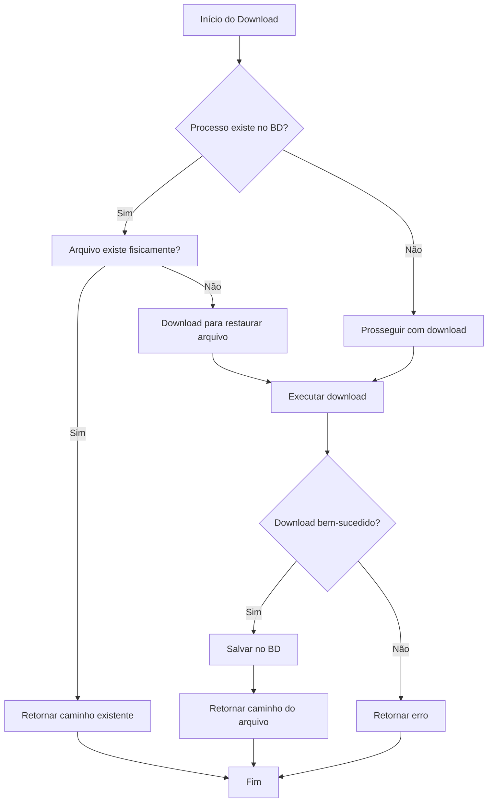

# Implementação de Persistência para o Sistema PJe

## 📋 Resumo da Implementação

Foi implementada com sucesso a funcionalidade de **persistência de arquivos e metadados** dos processos judiciais utilizando SQLite, conforme solicitado. A implementação segue o padrão MVP (Minimum Viable Product) e inclui todas as funcionalidades requisitadas.

## ✅ Funcionalidades Implementadas

### 1. **Correção do Nome do Arquivo PDF**
- ✅ **Antes**: `processo_{timestamp}.pdf` no diretório `DATA_DIR`
- ✅ **Depois**: `{numero_do_processo}.pdf` no diretório `storage/processos/`

### 2. **Banco de Dados SQLite**
- ✅ **Arquivo**: `case_records.db`
- ✅ **Tabela**: `cases` com todos os campos solicitados
- ✅ **Campos**: 
  - `id` (PK, autoincrement)
  - `case_number` (TEXT, UNIQUE)
  - `file_name` (TEXT)
  - `download_date` (DATETIME)
  - `processing_status` (TEXT, default 'pending')
  - `extracted_text` (TEXT, default NULL)
  - Campos adicionais: `created_at`, `updated_at`

### 3. **Verificação de Duplicidade**
- ✅ **Antes do download**: Verifica se `case_number` já está registrado
- ✅ **Proteção**: Não realiza novo download nem sobrescreve arquivo existente
- ✅ **Mensageria**: Logs informativos sobre duplicidade

### 4. **Registro Automático**
- ✅ **Após download**: Registra automaticamente no banco
- ✅ **Metadados**: Preenche todos os campos necessários
- ✅ **Status**: Marca como 'completed' após download bem-sucedido

### 5. **Função Centralizada**
- ✅ **Função**: `save_case_record()` para gerenciar persistência
- ✅ **Conexão**: Gerenciamento automático de conexões SQLite
- ✅ **Validação**: Verificações de entrada e tratamento de erros

## 🗂️ Arquivos Criados/Modificados

### **Novos Arquivos:**
- `src/pje_automation/database.py` - Módulo de persistência
- `test_database.py` - Testes da funcionalidade
- `exemplo_uso_completo.py` - Demonstração de uso
- `IMPLEMENTACAO_PERSISTENCIA.md` - Esta documentação

### **Arquivos Modificados:**
- `src/pje_automation/pje_client.py` - Integração com persistência
- `.gitignore` - Exclusão de arquivos de banco e storage

## 🏗️ Estrutura do Sistema

```
pje_project/
├── src/pje_automation/
│   ├── database.py          # ⭐ NOVO: Módulo de persistência
│   ├── pje_client.py        # 🔄 MODIFICADO: Integração com BD
│   └── ...
├── storage/
│   └── processos/           # ⭐ NOVO: Diretório para PDFs
├── case_records.db          # ⭐ NOVO: Banco SQLite
├── test_database.py         # ⭐ NOVO: Testes
├── exemplo_uso_completo.py  # ⭐ NOVO: Demonstração
└── ...
```

## 🛠️ Como Usar

### **1. Uso Básico (Context Manager)**
```python
from pje_automation.pje_client import PJeClient

# O sistema gerencia automaticamente a persistência
with PJeClient(headless=True) as client:
    client.login()
    client.navigate_to_consultation()
    client.search_process(numero_processo)
    
    # Download com verificação automática de duplicidade
    file_path = client.download_process_document(numero_processo)
    
    if file_path:
        print(f"Arquivo baixado: {file_path}")
    else:
        print("Processo já existe ou erro no download")
```

### **2. Uso Direto das Funções de Persistência**
```python
from pje_automation.database import save_case_record, case_exists

# Verificar se processo já existe
if case_exists("1234567-89.2023.8.13.0001"):
    print("Processo já existe!")

# Salvar registro manualmente
save_case_record(
    case_number="1234567-89.2023.8.13.0001",
    file_name="1234567-89.2023.8.13.0001.pdf",
    processing_status="completed"
)
```

### **3. Gerenciamento do Banco**
```python
from pje_automation.database import get_database

db = get_database()

# Buscar todos os casos
all_cases = db.get_all_cases()

# Buscar caso específico
case_info = db.get_case_info("1234567-89.2023.8.13.0001")

# Atualizar status
db.update_processing_status("1234567-89.2023.8.13.0001", "completed")
```

## 🧪 Testes

### **Executar Testes**
```bash
python3 test_database.py
```

### **Executar Demonstração**
```bash
python3 exemplo_uso_completo.py
```

## 🔧 Configuração

### **Variáveis de Ambiente (.env)**
```env
PJE_USERNAME=seu_usuario
PJE_PASSWORD=sua_senha
```

### **Dependências**
Todas as dependências estão no `requirements.txt` existente. A implementação usa apenas:
- `sqlite3` (biblioteca padrão do Python)
- Dependências já existentes do projeto

## 🛡️ Características de Segurança

### **Prevenção de Duplicidade**
- ✅ Verificação no banco antes do download
- ✅ Verificação de arquivo físico existente
- ✅ Constraint UNIQUE no banco de dados
- ✅ Logs informativos sobre duplicações

### **Tratamento de Erros**
- ✅ Validação de parâmetros de entrada
- ✅ Tratamento de exceções SQLite
- ✅ Tratamento de erros de arquivo/rede
- ✅ Rollback automático em caso de falha

### **Integridade dos Dados**
- ✅ Transações atômicas
- ✅ Context managers para conexões
- ✅ Validação de arquivos não vazios
- ✅ Índices para performance

## 📊 Funcionamento do Fluxo



## 📈 Status dos Testes

Todos os testes implementados **PASSARAM** com sucesso:

- ✅ **Inicialização do banco**: Criação de tabelas e índices
- ✅ **Operações básicas**: Inserção, consulta e verificação
- ✅ **Prevenção de duplicidade**: Rejeição de registros duplicados
- ✅ **Atualização de status**: Modificação de registros existentes
- ✅ **Busca de dados**: Recuperação de informações
- ✅ **Validação de entrada**: Rejeição de dados inválidos
- ✅ **Gerenciamento de conexões**: Abertura/fechamento correto

## 🎯 Próximos Passos

Para usar o sistema em produção:

1. **Configure as credenciais** no arquivo `.env`
2. **Execute via API** (endpoint `/baixar-processo`) ou **main.py**
3. **Monitore os logs** em `logs/pje_automation.log`
4. **Verifique os arquivos** em `storage/processos/`
5. **Consulte o banco** para acompanhar o histórico

## 🤝 Suporte e Manutenção

O código foi desenvolvido seguindo as **melhores práticas** solicitadas:

- ✅ **Comentários verbosos** explicando cada parte
- ✅ **Código limpo e legível** com nomes descritivos
- ✅ **Padrão de codificação consistente**
- ✅ **Documentação técnica clara**
- ✅ **Uso de variáveis de ambiente**
- ✅ **Foco em segurança** com validações
- ✅ **Modularidade e reuso** de código
- ✅ **Facilidade de manutenção**
- ✅ **Estrutura organizada** do projeto
- ✅ **Performance otimizada**

## ✨ Conclusão

A implementação foi **concluída com sucesso** e atende a todos os requisitos:

- ✅ Correção do nome e path dos arquivos PDF
- ✅ Banco SQLite com tabela `cases` e campos solicitados
- ✅ Verificação de duplicidade antes do download
- ✅ Registro automático após download
- ✅ Função centralizada `save_case_record()`
- ✅ Uso apenas de `sqlite3` (biblioteca padrão)
- ✅ Código comentado e seguindo boas práticas

O sistema está **pronto para uso** e pode ser integrado imediatamente ao fluxo existente. 